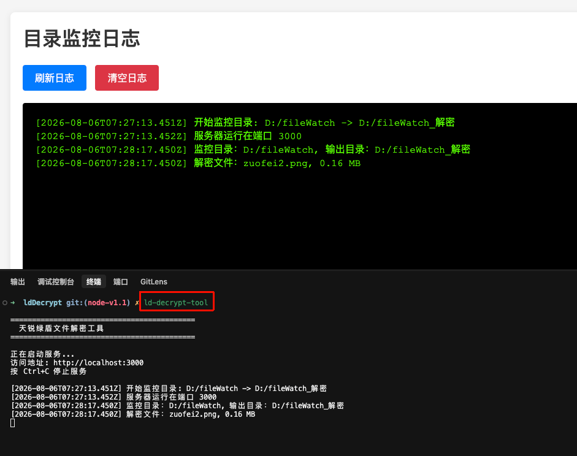
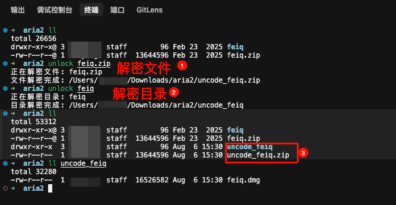

# 天锐绿盾文件解密工具

基于 Node.js 的绿盾加密文件解密工具。利用本机已安装的绿盾客户端权限，读取加密文件并写出解密副本。提供 Web 界面、REST API、目录监控与命令行多种交互方式。

## Windows Desktop 版（推荐）

本仓库 fork 自 [zlhy7/ldDecrypt](https://github.com/zlhy7/ldDecrypt)。Desktop、Portable Release 和 CI/CD 是本 fork 的扩展；原有 Web / REST API、目录监控和 CLI 解密能力保持与上游兼容。

普通 Windows 用户可以从 [Latest Release](https://github.com/laipeng101/ldDecrypt/releases/latest) 下载：

`ldDecrypt-*-win-x64-portable.exe`

`.sha256` 文件用于校验下载文件完整性。请勿把 Release 页中的 Source code zip/tar.gz 当作 Windows 程序。

- 适用：Windows 11 x64；无需安装
- Desktop 已包含运行所需环境，无需单独安装 Node.js/npm
- 启动时临时启动本机 Web Core，仅监听 `127.0.0.1`，端口由系统分配
- 正常关闭窗口时，Web Core 和目录监听随应用退出；不设计为托盘或后台常驻服务
- 不注册 Windows Service、不配置开机自启、不提供托盘常驻
- Core 运行数据在 `%APPDATA%\lddecrypt-desktop\runtime`；Electron/Chromium 缓存仍在应用自身 userData 中
- 当前 EXE 未配置 Authenticode 代码签名，Windows 可能显示“未知发布者”或 SmartScreen 提示；请确认下载来源并使用 SHA256 校验

| 模式 | 适合 | Node.js | 后台 | 启动方式 |
| --- | --- | --- | --- | --- |
| Desktop Portable | 日常临时使用 | 不需要单独安装 | 不常驻 | 双击 EXE |
| CLI / Web 源码模式 | 自动化、API、长时间监听 | 需要 | 可自行配置 | npm / `ld-decrypt-tool` |

校验示例：

```powershell
Get-ChildItem .\ldDecrypt-*-win-x64-portable.exe |
  Get-FileHash -Algorithm SHA256
```

将输出值与 Release 中对应 `.sha256` 文件比较。

使用步骤：

1. 打开 [Latest Release](https://github.com/laipeng101/ldDecrypt/releases/latest)
2. 下载 Portable EXE
3. 双击运行，在应用窗口使用 Web UI
4. 使用完成后直接关闭窗口

更多下载、生命周期、数据目录、校验与开发说明见 [Desktop 详细说明](desktop/README.md)。

- 包名：`@zlhy7/ld-decrypt-tool`
- Node 要求：`>= 22`（推荐 `v24.20.0 LTS`）
- 仓库：[gitee.com/zlhy7/ldDecrypt](https://gitee.com/zlhy7/ldDecrypt)

## 参考项目

- [绿盾解密 node 版本相关讨论](https://github.com/zlhy7/ldDecrypt/issues/7)
- 上游思路：借助本机绿盾环境可读加密文件的能力，流式拷贝为明文文件

## 项目介绍

本工具本身不做密码破解，而是在**已具备绿盾解密权限**的机器上，把「能打开的加密文件」另存为普通文件，便于自动化批处理、接口对接与目录监听。

典型场景：

- 内网办公机装了绿盾，需要批量导出可读副本
- 通过 HTTP 接口给其他系统做解密中转
- 监控投递目录，文件进来即自动解密到输出目录

## 功能特点

1. **Web / REST API** — 浏览器上传解密，或 `curl` 调接口拿结果
2. **目录监控** — 监听源目录，自动解密到目标目录，并提供监控日志页
3. **命令行** — `unlock` 解密单文件或整目录
4. **全局安装（`globalinstall`）** — 注册系统全局命令；Windows 额外开机自启
5. **跨平台脚本** — `globalinstall` / `globalunstall` / `publish:npm` 在 Win / macOS / Linux 均可执行

## 安装服务

以下章节为源码 / npm / CLI 模式；Desktop Portable 用户无需执行这些安装步骤。

### 方式一：本地项目安装
拉取源码后，执行安装命令
```shell
# 1. 安装依赖（开发 / 运行源码）
npm install

# 2. 注册到系统全局命令（可选；无 node_modules 时 globalinstall 会先装依赖）
npm run globalinstall
```

会：

1. `npm install -g .` 注册全局命令：`ld-decrypt`、`ld-decrypt-tool`、`unlock`
2. **仅 Windows**：配置开机自启并尝试后台启动服务
3. 安装结束会检查全局目录 / PATH；若命令找不到会打印修复步骤

> Windows 若提示「不是内部或外部命令」：多半是 `%AppData%\npm` 不在 PATH，或当前 CMD 没刷新。  
> 把该目录加入用户 Path 后**新开** CMD，或直接关掉窗口再开一个再试。

### 从系统卸载

```shell
npm run globalunstall
```

会：

1. 移除全局命令（服务启动命令与 `unlock` 命令行都不可用）
2. **仅 Windows**：清除开机自启

### 方式二：从 npm 全局安装（外网）

```shell
# 安装
npm install -g @zlhy7/ld-decrypt-tool

# 开启开机自启（仅 Windows，可选）
ld-decrypt-tool enable

# 关闭开机自启
ld-decrypt-tool disable

# 卸载
npm uninstall -g @zlhy7/ld-decrypt-tool
```

> `npm install -g` **不会**自动开自启，需手动执行 `ld-decrypt-tool enable`。
> 源码侧 `npm run globalinstall` 在 Windows 上会顺带尝试开启自启。
## 本地项目：编译 / 运行（可选）

本项目为纯 Node.js 源码，**无需编译**。安装依赖后直接运行：

```shell
npm start          # 生产方式启动 Web 服务
npm run dev        # nodemon 热重启（开发）
npm run smoke      # 推远程 / 发版前本地冒烟测试（推荐）
```

全局安装（`npm run globalinstall`）后，也可用：

```shell
ld-decrypt
ld-decrypt-tool
```

## 发布私服 / npm

将当前版本推到 npm（`publishConfig` 指定的源，当前为官方 `registry.npmjs.org`），供外网全局安装：

```shell
# 1. 在 .npmrc 配置真实 _authToken（勿提交明文密钥）
# 2. 如需升版本：npm version patch
npm run publish:npm
```

## 如何使用

### 前提

- 电脑已安装并可正常使用绿盾环境，否则解密结果不可用
- Node.js `>= 22`（推荐 `v24.20.0 LTS`），安装教程参考[Node.js 安装教程](https://shafulin.hitcard.cc/znote/views/notes/installation_tutorial/nodejs)

### Web 界面启动

```shell
# 前台启动（窗口保持；已在跑会提示）
ld-decrypt-tool

# 后台静默启动（已在跑会提示）
ld-decrypt-tool start

# 停止服务（未在跑会提示）
ld-decrypt-tool stop
```


浏览器访问：`http://localhost:3000`

监控日志页：`http://localhost:3000/monitor`

### 解密方式一：REST API

```shell
curl -X POST -F "file=@加密文件.txt" http://localhost:3000/api/decrypt --output 解密文件.txt
```

### 解密方式二：目录监控,可自定义监控目录和解密目录

启动服务后，可在 Web 页配置监控目录；也可用环境变量：

```shell
MONITORED_PATH=/path/to/watch 
MONITORED_DECRYPT_PATH=/path/to/decrypt
```

默认（Windows：优先 `D:`，没有 D 盘则用 `C:`）：

- 监控：`{盘符}/fileWatch`（如 `D:/fileWatch` 或 `C:/fileWatch`）
- 输出：`{盘符}/fileWatch_解密`

### 解密方式三：命令行

```shell
# 解密单个文件（未指定输出时，在当前目录生成 uncode_*）
unlock ./encrypted-file.txt
unlock ./encrypted-file.txt ./decrypted-file.txt

# 解密整个目录
unlock ./encrypted-dir/ ./decrypted-dir/
```


### 环境变量

| 变量 | 说明 | 默认 |
|------|------|------|
| `PORT` | Web 服务端口 | `3000` |
| `MONITORED_PATH` | 监控源目录 | Windows：`D:/fileWatch`（无 D 则 `C:/fileWatch`） |
| `MONITORED_DECRYPT_PATH` | 解密输出目录 | Windows：`D:/fileWatch_解密`（无 D 则 `C:/...`） |

### 开机自启（仅 Windows）

```shell
ld-decrypt-tool enable    # 开启自启；若服务未跑则同时后台静默启动（无黑窗，仅 Windows）
ld-decrypt-tool disable   # 关闭自启
```

说明：

- 自启用 **VBS 隐藏窗口**（`WScript.Shell.Run ..., 0`），**不用 bat**（bat 会弹黑框）
- `enable` 会自动删掉旧版 `ld-decrypt-tool.bat`，避免残留弹窗
- `npm install -g` 后请手动 `enable`（不会自动开）
- `npm run globalinstall`（源码）在 Windows 上会尝试自动 `enable`
- `npm run globalunstall` / `disable` 都会清自启
- macOS / Linux：`enable` / `disable` 会提示不支持并退出
- 兼容旧入口：`node scripts/setup-autostart.js`（等同 `enable`）

## 注意事项

请确保你有权解密目标文件，并遵守所在地区法律法规及企业数据安全政策。勿将本工具用于未授权数据外传或其他违法用途。

## 纯小白安装教程

### 1.安装nodejs

`官直`[node-v24.20.0](https://nodejs.org/dist/v24.20.0/node-v24.20.0-x64.msi) | [nodejs官网](https://nodejs.org/zh-cn/download)

安装时无脑下一步就行，安装完成后，在cmd中输入`node -v`，如果出现版本号，则说明安装成功。

### 2.安装命令
```shell
npm install -g @zlhy7/ld-decrypt-tool
```

### 3.开机自启（可选，仅 Windows）
```shell
# 开启自启；若当前服务未跑，会同时后台静默启动（无黑窗）
ld-decrypt-tool enable

# 关闭自启
ld-decrypt-tool disable
```

### 4.启动 / 停止服务
> Web 服务用于查看解密日志和配置监控目录；纯命令行 `unlock` 可不启服务。

```shell
# 前台启动（关掉窗口即停；已在跑会提示）
ld-decrypt-tool

# 后台静默启动（无黑窗；已在跑会提示）
ld-decrypt-tool start

# 停止服务（未在跑会提示）
ld-decrypt-tool stop
```

### 5.命令行解密
```shell
# 解密单个文件
unlock ./encrypted-file.txt
unlock ./encrypted-file.txt ./decrypted-file.txt

# 解密整个目录
unlock ./encrypted-dir/ ./decrypted-dir/
```
